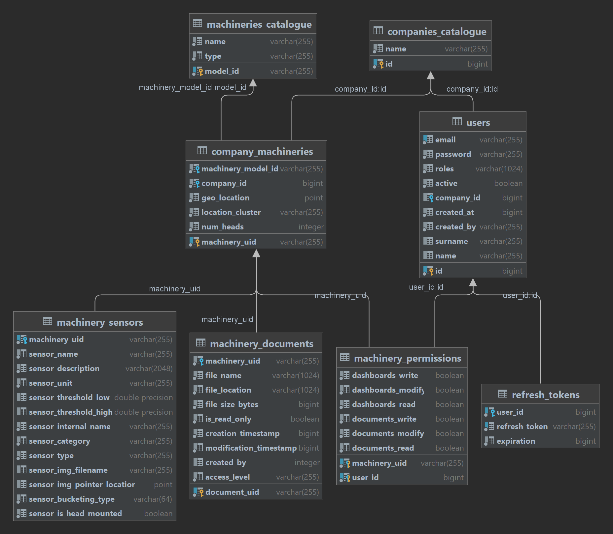

# AROL-CLOUD (SDP Projects 2023-2024)

## How to run project locally

### Set up env file:

Step 1: ```cd ./express-server``` and create a file name ".env"

Step 2: Paste the following content in it

```
JWT_SECRET_KEY=6c9c23d766e7cf2280dfdb8fca8f97841ddcd80eee01eb0cbaff85037848962f
JWT_EXPIRATION=900000
REFRESH_TOKEN_SECRET_KEY=47e648a61b5c7c8b3d12bb9c46dbc64f35fd2d3fb22bfc5debc9d7cf6036ff1b
REFRESH_TOKEN_EXPIRATION=2592000000
POSTGRES_HOST=localhost
POSTGRES_PORT=5432
POSTGRES_USER=postgres
POSTGRES_PASSWORD=postgres
MONGODB_HOST=localhost
MONGODB_PORT=27017
```

### Important note

To run project locally, PostgreSQL and MongoDB need to be installed in the system. DB configuration scripts/exports for both
DBMS-es can be found under ```Docker/pg``` and ```Docker/mongo/data``` dirs. These exports need to be imported into the corresponding DBMS manually.

### Run server

Step 1: ```cd ./express-server```

Step 2: ```npm install --force```

Step 3: ```npm run start:dev```

### Run client

Step 1: ```cd ./react-client```

Step 2: ```npm install --force```

Step 3: ```npm run start```

## How to run project with Docker

Step 1: ```Make sure you have Docker installed locally on your system```

Step 2: ```cd ./Docker```

Step 3: ```docker compose up --build```

Step 4: ```Open Docker Desktop and make sure to run all the containers under the "arol-cloud" container```

Step 5: ```Open http://localhost:3000 on you favourite browser```

### PostgreSQL credentials

```username: postgres```
```password: postgres```
```port: 5432```

## DB Schema



### Available users and credentials

#### User 1

```username: mariodeda@hotmail.com```
```password: 123```
```roles: Administrator```

#### User 2

```username: mariodeda2@hotmail.com```
```password: 123```
```roles: Worker```

#### User 3

```username: test2@hotmail.com```
```password: 12345678```
``roles: Worker```

#### User 4

```username: worker@hotmail.com```
```password: 12345678```
```roles: Worker, Manager```

## API Documentation

Base URLs:

* <a href="http://localhost:8080">http://localhost:8080</a>

Email: <a href="mailto:mariodeda@hotmail.com">Support</a>

# Authentication

- HTTP Authentication, scheme: bearer

<h1 id="arol-public">public</h1>

Public operations (no auth token needed)

## post__public_login

`POST /public/login`

*Initial authentication*

Perform initial authentication to obtain JWT auth token

> Body parameter

```json
{
  "email": "example@email.com",
  "password": 12345678
}
```

<h3 id="post__public_login-parameters">Parameters</h3>

| Name       | In   | Type                                        | Required | Description |
|------------|------|---------------------------------------------|----------|-------------|
| body       | body | [LoginCredentials](#schemalogincredentials) | true     | none        |
| » email    | body | string                                      | true     | none        |
| » password | body | string                                      | true     | none        |

> Example responses

> 200 Response

```json
{
  "id": 0,
  "companyID": "string",
  "name": "string",
  "surname": "string",
  "email": "string",
  "roles": [
    "string"
  ],
  "authToken": "string",
  "authTokenExpiration": 0,
  "refreshToken": "string",
  "refreshTokenExpiry": 0,
  "permissions": {
    "machineryUID": {
      "dashboardsWrite": true,
      "dashboardsModify": true,
      "dashboardsRead": true,
      "documentsWrite": true,
      "documentsModify": true,
      "documentsRead": true
    }
  }
}
```

<h3 id="post__public_login-responses">Responses</h3>

| Status | Meaning                                                        | Description                         | Schema                                |
|--------|----------------------------------------------------------------|-------------------------------------|---------------------------------------|
| 200    | [OK](https://tools.ietf.org/html/rfc7231#section-6.3.1)        | Successful operation                | [LoginResponse](#schemaloginresponse) |
| 403    | [Forbidden](https://tools.ietf.org/html/rfc7231#section-6.5.3) | Bad credentials or account disabled | None                                  |

<aside class="success">
This operation does not require authentication
</aside>

## post__public_logout

`POST /public/logout`

*Logout*

Perform logout and delete any refresh tokens associated to this session

<h3 id="post__public_logout-parameters">Parameters</h3>

| Name  | In    | Type    | Required | Description |
|-------|-------|---------|----------|-------------|
| id    | query | integer | false    | none        |
| token | query | string  | false    | none        |

<h3 id="post__public_logout-responses">Responses</h3>

| Status | Meaning                                                 | Description       | Schema |
|--------|---------------------------------------------------------|-------------------|--------|
| 200    | [OK](https://tools.ietf.org/html/rfc7231#section-6.3.1) | Logout successful | None   |

<aside class="success">
This operation does not require authentication
</aside>

## get__public_refreshtoken

`GET /public/refreshtoken`

*JWT token refresh*

Refresh JWT token by providing a valid refresh token

<h3 id="get__public_refreshtoken-parameters">Parameters</h3>

| Name  | In    | Type    | Required | Description |
|-------|-------|---------|----------|-------------|
| id    | query | integer | false    | none        |
| token | query | string  | false    | none        |

> Example responses

> 200 Response

```json
{
  "id": 0,
  "companyID": "string",
  "name": "string",
  "surname": "string",
  "email": "string",
  "roles": [
    "string"
  ],
  "authToken": "string",
  "authTokenExpiration": 0,
  "refreshToken": "string",
  "refreshTokenExpiry": 0,
  "permissions": {
    "machineryUID": {
      "dashboardsWrite": true,
      "dashboardsModify": true,
      "dashboardsRead": true,
      "documentsWrite": true,
      "documentsModify": true,
      "documentsRead": true
    }
  }
}
```

<h3 id="get__public_refreshtoken-responses">Responses</h3>

| Status | Meaning                                                          | Description              | Schema                                |
|--------|------------------------------------------------------------------|--------------------------|---------------------------------------|
| 200    | [OK](https://tools.ietf.org/html/rfc7231#section-6.3.1)          | Token refresh successful | [LoginResponse](#schemaloginresponse) |
| 400    | [Bad Request](https://tools.ietf.org/html/rfc7231#section-6.5.1) | Invalid refresh token    | None                                  |
| 401    | [Unauthorized](https://tools.ietf.org/html/rfc7235#section-3.1)  | Invalid refresh token    | None                                  |
| 403    | [Forbidden](https://tools.ietf.org/html/rfc7231#section-6.5.3)   | Account disabled         | None                                  |

<aside class="success">
This operation does not require authentication
</aside>

## get__public_status

`GET /public/status`

*Health*

Check server health

<h3 id="get__public_status-responses">Responses</h3>

| Status | Meaning                                                 | Description                         | Schema |
|--------|---------------------------------------------------------|-------------------------------------|--------|
| 200    | [OK](https://tools.ietf.org/html/rfc7231#section-6.3.1) | Server is on and accepting requests | None   |

<aside class="success">
This operation does not require authentication
</aside>

<h1 id="arol-company">company</h1>

Operations about AROL customer companies

## get__company

`GET /company`

*Company information*

Get the current authenticated user company information

> Example responses

> 200 Response

```json
{
  "id": 0,
  "name": "string"
}
```

<h3 id="get__company-responses">Responses</h3>

| Status | Meaning                                                         | Description                                 | Schema                                    |
|--------|-----------------------------------------------------------------|---------------------------------------------|-------------------------------------------|
| 200    | [OK](https://tools.ietf.org/html/rfc7231#section-6.3.1)         | Company details                             | [CompanyResponse](#schemacompanyresponse) |
| 401    | [Unauthorized](https://tools.ietf.org/html/rfc7235#section-3.1) | Authentication failed                       | None                                      |
| 404    | [Not Found](https://tools.ietf.org/html/rfc7231#section-6.5.4)  | No company found for the authenticated user | None                                      |

<aside class="warning">
To perform this operation, you must be authenticated by means of one of the following methods:
bearerAuth
</aside>

<h1 id="arol-machinery">machinery</h1>

Operations on customer company machineries

## get__machinery_company

`GET /machinery/company`

*Company machineries*

Get all the authenticated user company machineries

> Example responses

> 200 Response

```json
{
  "locationCluster": [
    {
      "uid": "string",
      "companyID": 0,
      "modelID": "string",
      "modelName": "string",
      "modelType": "string",
      "geoLocation": {
        "x": 0,
        "y": 0
      },
      "locationCluster": "string",
      "numHeads": 0
    }
  ]
}
```

<h3 id="get__machinery_company-responses">Responses</h3>

| Status | Meaning                                                          | Description                                                                                                                                              | Schema                                                          |
|--------|------------------------------------------------------------------|----------------------------------------------------------------------------------------------------------------------------------------------------------|-----------------------------------------------------------------|
| 200    | [OK](https://tools.ietf.org/html/rfc7231#section-6.3.1)          | Company machineries groupped by their corresponding location cluster. Each cluster contains the actual array of machineries that belong to that cluster. | [CompanyMachineriesResponse](#schemacompanymachineriesresponse) |
| 400    | [Bad Request](https://tools.ietf.org/html/rfc7231#section-6.5.1) | Invalid company ID detected                                                                                                                              | None                                                            |
| 401    | [Unauthorized](https://tools.ietf.org/html/rfc7235#section-3.1)  | Authentication failed                                                                                                                                    | None                                                            |

<aside class="warning">
To perform this operation, you must be authenticated by means of one of the following methods:
bearerAuth
</aside>

## get__machinery_company_{machineryUID}

`GET /machinery/company/{machineryUID}`

*Machinery by its UID*

Get the authenticated user company machinery by its UID

<h3 id="get__machinery_company_{machineryuid}-parameters">Parameters</h3>

| Name         | In   | Type   | Required | Description                      |
|--------------|------|--------|----------|----------------------------------|
| machineryUID | path | string | true     | The UID of the desired machinery |

> Example responses

> 200 Response

```json
{
  "uid": "string",
  "companyID": 0,
  "modelID": "string",
  "modelName": "string",
  "modelType": "string",
  "geoLocation": {
    "x": 0,
    "y": 0
  },
  "locationCluster": "string",
  "numHeads": 0
}
```

<h3 id="get__machinery_company_{machineryuid}-responses">Responses</h3>

| Status | Meaning                                                          | Description                                                                       | Schema                                        |
|--------|------------------------------------------------------------------|-----------------------------------------------------------------------------------|-----------------------------------------------|
| 200    | [OK](https://tools.ietf.org/html/rfc7231#section-6.3.1)          | Machinery information                                                             | [MachineryResponse](#schemamachineryresponse) |
| 400    | [Bad Request](https://tools.ietf.org/html/rfc7231#section-6.5.1) | Invalid company ID detected                                                       | None                                          |
| 401    | [Unauthorized](https://tools.ietf.org/html/rfc7235#section-3.1)  | Authentication failed                                                             | None                                          |
| 403    | [Forbidden](https://tools.ietf.org/html/rfc7231#section-6.5.3)   | Insufficient permissions                                                          | None                                          |
| 404    | [Not Found](https://tools.ietf.org/html/rfc7231#section-6.5.4)   | Machinery with this UID and that belongs the authenticated user company not found | None                                          |

<aside class="warning">
To perform this operation, you must be authenticated by means of one of the following methods:
bearerAuth
</aside>

## get__machinery_sensors

`GET /machinery/sensors`

*Machinery sensors by its UID*

Get the authenticated user company machinery sensors by its UID

<h3 id="get__machinery_sensors-parameters">Parameters</h3>

| Name         | In    | Type   | Required | Description                      |
|--------------|-------|--------|----------|----------------------------------|
| machineryUID | query | string | true     | The UID of the desired machinery |

> Example responses

> 200 Response

```json
[
  {
    "machineryUID": "string",
    "name": "string",
    "description": "string",
    "unit": "string",
    "thresholdLow": 0,
    "thresholdHigh": 0,
    "internalName": "string",
    "category": "string",
    "type": "string",
    "isHeadMounted": true,
    "bucketingType": "string",
    "imgFilename": 0,
    "imgPointerLocation": {
      "x": 0,
      "y": 0
    }
  }
]
```

<h3 id="get__machinery_sensors-responses">Responses</h3>

| Status | Meaning                                                          | Description                   | Schema                                                      |
|--------|------------------------------------------------------------------|-------------------------------|-------------------------------------------------------------|
| 200    | [OK](https://tools.ietf.org/html/rfc7231#section-6.3.1)          | Machinery sensors information | [MachinerySensorsResponse](#schemamachinerysensorsresponse) |
| 400    | [Bad Request](https://tools.ietf.org/html/rfc7231#section-6.5.1) | Invalid company ID detected   | None                                                        |
| 401    | [Unauthorized](https://tools.ietf.org/html/rfc7235#section-3.1)  | Authentication failed         | None                                                        |
| 403    | [Forbidden](https://tools.ietf.org/html/rfc7231#section-6.5.3)   | Insufficient permissions      | None                                                        |

<aside class="warning">
To perform this operation, you must be authenticated by means of one of the following methods:
bearerAuth
</aside>

## post__machinery_sensors_data

`POST /machinery/sensors/data`

*Machinery sensors data by its UID*

Get the authenticated user company machinery sensors data by its UID. The returned data will be filtered using the
parameters sent using the request body.

> Body parameter

```json
{
  "sensorFilters": {
    "requestType": "string",
    "cacheDataRequestMaxTime": 0,
    "newDataRequestMinTime": 0,
    "widgetCategory": "string",
    "dataRange": {
      "amount": 0,
      "unit": "string"
    },
    "sensors": {
      "sensorName": [
        {
          "headNumber": 0,
          "mechNumber": 0,
          "sensorNames": [
            {
              "name": "string",
              "color": "string"
            }
          ]
        }
      ]
    },
    "aggregations": [
      {
        "name": "string",
        "color": "string"
      }
    ]
  }
}
```

<h3 id="post__machinery_sensors_data-parameters">Parameters</h3>

| Name                       | In    | Type                                                | Required | Description                      |
|----------------------------|-------|-----------------------------------------------------|----------|----------------------------------|
| machineryUID               | query | string                                              | true     | The UID of the desired machinery |
| body                       | body  | [MachineryDataRequest](#schemamachinerydatarequest) | true     | none                             |
| » sensorFilters            | body  | object                                              | false    | none                             |
| »» requestType             | body  | string                                              | false    | none                             |
| »» cacheDataRequestMaxTime | body  | number                                              | false    | none                             |
| »» newDataRequestMinTime   | body  | number                                              | false    | none                             |
| »» widgetCategory          | body  | string                                              | false    | none                             |
| »» dataRange               | body  | object                                              | false    | none                             |
| »»» amount                 | body  | number                                              | false    | none                             |
| »»» unit                   | body  | string                                              | false    | none                             |
| »» sensors                 | body  | object                                              | false    | none                             |
| »»» sensorName             | body  | [object]                                            | false    | none                             |
| »»»» headNumber            | body  | number                                              | false    | none                             |
| »»»» mechNumber            | body  | number                                              | false    | none                             |
| »»»» sensorNames           | body  | [object]                                            | false    | none                             |
| »»»»» name                 | body  | string                                              | false    | none                             |
| »»»»» color                | body  | string                                              | false    | none                             |
| »» aggregations            | body  | [object]                                            | false    | none                             |
| »»» name                   | body  | string                                              | false    | none                             |
| »»» color                  | body  | string                                              | false    | none                             |

> Example responses

> 200 Response

```json
{
  "requestType": "string",
  "minDisplayTime": 0,
  "cachedSensorData": {
    "active": true,
    "machineryOff": true,
    "machineryOffFrom": 0,
    "machineryOffTo": 0,
    "time": 0,
    "minTime": 0,
    "maxTime": 0,
    "formattedTime": "string",
    "activeData": {
      "sensorInternalName": 0
    },
    "fillerData": {
      "sensorInternalName": 0
    },
    "allData": {
      "sensorInternalName": 0
    },
    "aggregationData": {
      "aggregationName": {
        "value": 0,
        "note": "string"
      }
    }
  },
  "displaySensorData": {
    "active": true,
    "machineryOff": true,
    "machineryOffFrom": 0,
    "machineryOffTo": 0,
    "time": 0,
    "minTime": 0,
    "maxTime": 0,
    "formattedTime": "string",
    "activeData": {
      "sensorInternalName": 0
    },
    "fillerData": {
      "sensorInternalName": 0
    },
    "allData": {
      "sensorInternalName": 0
    },
    "aggregationData": {
      "aggregationName": {
        "value": 0,
        "note": "string"
      }
    }
  },
  "newSensorData": {
    "active": true,
    "machineryOff": true,
    "machineryOffFrom": 0,
    "machineryOffTo": 0,
    "time": 0,
    "minTime": 0,
    "maxTime": 0,
    "formattedTime": "string",
    "activeData": {
      "sensorInternalName": 0
    },
    "fillerData": {
      "sensorInternalName": 0
    },
    "allData": {
      "sensorInternalName": 0
    },
    "aggregationData": {
      "aggregationName": {
        "value": 0,
        "note": "string"
      }
    }
  },
  "numSensorData": 0,
  "endOfData": true
}
```

<h3 id="post__machinery_sensors_data-responses">Responses</h3>

| Status | Meaning                                                          | Description                 | Schema                                                |
|--------|------------------------------------------------------------------|-----------------------------|-------------------------------------------------------|
| 200    | [OK](https://tools.ietf.org/html/rfc7231#section-6.3.1)          | Machinery sensors data      | [MachineryDataResponse](#schemamachinerydataresponse) |
| 400    | [Bad Request](https://tools.ietf.org/html/rfc7231#section-6.5.1) | Invalid company ID detected | None                                                  |
| 401    | [Unauthorized](https://tools.ietf.org/html/rfc7235#section-3.1)  | Authentication failed       | None                                                  |
| 403    | [Forbidden](https://tools.ietf.org/html/rfc7231#section-6.5.3)   | Insufficient permissions    | None                                                  |

<aside class="warning">
To perform this operation, you must be authenticated by means of one of the following methods:
bearerAuth
</aside>

<h1 id="arol-users">users</h1>

Public operations (no auth token needed)

## get__users_company

`GET /users/company`

*Company users*

Get all company users (Admin only)

> Example responses

> 200 Response

```json
[
  {
    "id": 0,
    "email": "string",
    "name": "string",
    "surname": "string",
    "roles": [
      "string"
    ],
    "active": true,
    "companyID": 0,
    "createdAt": 0,
    "createdBy": "string"
  }
]
```

<h3 id="get__users_company-responses">Responses</h3>

| Status | Meaning                                                          | Description              | Schema                              |
|--------|------------------------------------------------------------------|--------------------------|-------------------------------------|
| 200    | [OK](https://tools.ietf.org/html/rfc7231#section-6.3.1)          | Company users            | [CompanyUsers](#schemacompanyusers) |
| 400    | [Bad Request](https://tools.ietf.org/html/rfc7231#section-6.5.1) | Invalid company ID       | None                                |
| 401    | [Unauthorized](https://tools.ietf.org/html/rfc7235#section-3.1)  | Authentication failed    | None                                |
| 403    | [Forbidden](https://tools.ietf.org/html/rfc7231#section-6.5.3)   | Insufficient permissions | None                                |

<aside class="warning">
To perform this operation, you must be authenticated by means of one of the following methods:
bearerAuth
</aside>

## post__users_create

`POST /users/create`

*Create new user account*

Create a new user account (Admin or Manager roles only)

> Body parameter

```json
{
  "email": "string",
  "password": "string",
  "name": "string",
  "surname": "string",
  "roles": [
    "string"
  ],
  "companyID": 0,
  "permissions": {
    "machineryUID": {
      "dashboardsWrite": true,
      "dashboardsModify": true,
      "dashboardsRead": true,
      "documentsWrite": true,
      "documentsModify": true,
      "documentsRead": true
    }
  }
}
```

<h3 id="post__users_create-parameters">Parameters</h3>

| Name                 | In   | Type                                                | Required | Description  |
|----------------------|------|-----------------------------------------------------|----------|--------------|
| body                 | body | [CreateAccountRequest](#schemacreateaccountrequest) | false    | Account data |
| » email              | body | string                                              | false    | none         |
| » password           | body | string                                              | false    | none         |
| » name               | body | string                                              | false    | none         |
| » surname            | body | string                                              | false    | none         |
| » roles              | body | [string]                                            | false    | none         |
| » companyID          | body | number¦null                                         | false    | none         |
| » permissions        | body | object                                              | false    | none         |
| »» machineryUID      | body | object                                              | false    | none         |
| »»» dashboardsWrite  | body | boolean                                             | false    | none         |
| »»» dashboardsModify | body | boolean                                             | false    | none         |
| »»» dashboardsRead   | body | boolean                                             | false    | none         |
| »»» documentsWrite   | body | boolean                                             | false    | none         |
| »»» documentsModify  | body | boolean                                             | false    | none         |
| »»» documentsRead    | body | boolean                                             | false    | none         |

> Example responses

> 200 Response

```json
{
  "email": "string",
  "password": "string",
  "name": "string",
  "surname": "string",
  "roles": [
    "string"
  ],
  "companyID": 0,
  "permissions": {
    "machineryUID": {
      "dashboardsWrite": true,
      "dashboardsModify": true,
      "dashboardsRead": true,
      "documentsWrite": true,
      "documentsModify": true,
      "documentsRead": true
    }
  }
}
```

<h3 id="post__users_create-responses">Responses</h3>

| Status | Meaning                                                         | Description              | Schema                                              |
|--------|-----------------------------------------------------------------|--------------------------|-----------------------------------------------------|
| 200    | [OK](https://tools.ietf.org/html/rfc7231#section-6.3.1)         | Created account          | [CreateAccountRequest](#schemacreateaccountrequest) |
| 401    | [Unauthorized](https://tools.ietf.org/html/rfc7235#section-3.1) | Authentication failed    | None                                                |
| 403    | [Forbidden](https://tools.ietf.org/html/rfc7231#section-6.5.3)  | Insufficient permissions | None                                                |

<aside class="warning">
To perform this operation, you must be authenticated by means of one of the following methods:
bearerAuth
</aside>

## post__users_details_update

`POST /users/details/update`

*Update user account details*

Update user accounts details

> Body parameter

```json
{
  "id": 0,
  "email": "string",
  "name": "string",
  "surname": "string",
  "roles": "string",
  "active": true
}
```

<h3 id="post__users_details_update-parameters">Parameters</h3>

| Name      | In   | Type                                                | Required | Description         |
|-----------|------|-----------------------------------------------------|----------|---------------------|
| body      | body | [UpdateAccountRequest](#schemaupdateaccountrequest) | false    | New account details |
| » id      | body | number                                              | false    | none                |
| » email   | body | string                                              | false    | none                |
| » name    | body | string                                              | false    | none                |
| » surname | body | string                                              | false    | none                |
| » roles   | body | string                                              | false    | none                |
| » active  | body | boolean                                             | false    | none                |

<h3 id="post__users_details_update-responses">Responses</h3>

| Status | Meaning                                                         | Description              | Schema |
|--------|-----------------------------------------------------------------|--------------------------|--------|
| 200    | [OK](https://tools.ietf.org/html/rfc7231#section-6.3.1)         | Account details updated  | None   |
| 401    | [Unauthorized](https://tools.ietf.org/html/rfc7235#section-3.1) | Authentication failed    | None   |
| 403    | [Forbidden](https://tools.ietf.org/html/rfc7231#section-6.5.3)  | Insufficient permissions | None   |

<aside class="warning">
To perform this operation, you must be authenticated by means of one of the following methods:
bearerAuth
</aside>

## post__users_password_reset

`POST /users/password/reset`

*Reset account password*

Reset account password and invalidate any refresh tokens associated to the given user

> Body parameter

```json
{
  "id": 0,
  "password": "string"
}
```

<h3 id="post__users_password_reset-parameters">Parameters</h3>

| Name       | In   | Type                                                | Required | Description         |
|------------|------|-----------------------------------------------------|----------|---------------------|
| body       | body | [PasswordResetRequest](#schemapasswordresetrequest) | false    | Password reset data |
| » id       | body | number                                              | false    | none                |
| » password | body | string                                              | false    | none                |

<h3 id="post__users_password_reset-responses">Responses</h3>

| Status | Meaning                                                         | Description                | Schema |
|--------|-----------------------------------------------------------------|----------------------------|--------|
| 200    | [OK](https://tools.ietf.org/html/rfc7231#section-6.3.1)         | Password succesfully reset | None   |
| 401    | [Unauthorized](https://tools.ietf.org/html/rfc7235#section-3.1) | Authentication failed      | None   |
| 403    | [Forbidden](https://tools.ietf.org/html/rfc7231#section-6.5.3)  | Insufficient permissions   | None   |

<aside class="warning">
To perform this operation, you must be authenticated by means of one of the following methods:
bearerAuth
</aside>

## get__users_permissions

`GET /users/permissions`

*User permissions*

Get user permissions wrt to the given machinery UID. If machinery UID is not provided, the list of all users permissions
will be returned. The response body will be an array of permission objects.

> Example responses

> 200 Response

```json
{
  "userID": 0,
  "machineryUID": "string",
  "dashboardsWrite": true,
  "dashboardsModify": true,
  "dashboardsRead": true,
  "documentsWrite": true,
  "documentsModify": true,
  "documentsRead": true
}
```

<h3 id="get__users_permissions-responses">Responses</h3>

| Status | Meaning                                                         | Description                              | Schema                                                    |
|--------|-----------------------------------------------------------------|------------------------------------------|-----------------------------------------------------------|
| 200    | [OK](https://tools.ietf.org/html/rfc7231#section-6.3.1)         | User permissions wrt given machinery UID | [UserPermissionsResponse](#schemauserpermissionsresponse) |
| 401    | [Unauthorized](https://tools.ietf.org/html/rfc7235#section-3.1) | Authentication failed                    | None                                                      |
| 403    | [Forbidden](https://tools.ietf.org/html/rfc7231#section-6.5.3)  | Insufficient permissions                 | None                                                      |

<aside class="warning">
To perform this operation, you must be authenticated by means of one of the following methods:
bearerAuth
</aside>

## post__users_permissions_update

`POST /users/permissions/update`

*Update user permissions*

Update user permissions

> Body parameter

```json
{
  "userID": 0,
  "machineryUID": "string",
  "dashboardsWrite": true,
  "dashboardsModify": true,
  "dashboardsRead": true,
  "documentsWrite": true,
  "documentsModify": true,
  "documentsRead": true
}
```

<h3 id="post__users_permissions_update-parameters">Parameters</h3>

| Name               | In   | Type                                                    | Required | Description          |
|--------------------|------|---------------------------------------------------------|----------|----------------------|
| body               | body | [UserPermissionsRequest](#schemauserpermissionsrequest) | false    | New user permissions |
| » userID           | body | number                                                  | false    | none                 |
| » machineryUID     | body | string                                                  | false    | none                 |
| » dashboardsWrite  | body | boolean                                                 | false    | none                 |
| » dashboardsModify | body | boolean                                                 | false    | none                 |
| » dashboardsRead   | body | boolean                                                 | false    | none                 |
| » documentsWrite   | body | boolean                                                 | false    | none                 |
| » documentsModify  | body | boolean                                                 | false    | none                 |
| » documentsRead    | body | boolean                                                 | false    | none                 |

<h3 id="post__users_permissions_update-responses">Responses</h3>

| Status | Meaning                                                         | Description                      | Schema |
|--------|-----------------------------------------------------------------|----------------------------------|--------|
| 200    | [OK](https://tools.ietf.org/html/rfc7231#section-6.3.1)         | Permissions updated successfully | None   |
| 401    | [Unauthorized](https://tools.ietf.org/html/rfc7235#section-3.1) | Authentication failed            | None   |
| 403    | [Forbidden](https://tools.ietf.org/html/rfc7231#section-6.5.3)  | Insufficient permissions         | None   |

<aside class="warning">
To perform this operation, you must be authenticated by means of one of the following methods:
bearerAuth
</aside>

<h1 id="arol-dashboards">dashboards</h1>

Operations on customer company machinery dashboards

## post__dashboard_save

`POST /dashboard/save`

*Save dashboard configuration*

Save dashboard configuration for the given machinery

> Body parameter

```json
{
  "dashboard": {}
}
```

<h3 id="post__dashboard_save-parameters">Parameters</h3>

| Name        | In   | Type                                                | Required | Description |
|-------------|------|-----------------------------------------------------|----------|-------------|
| body        | body | [SaveDashboardRequest](#schemasavedashboardrequest) | false    | none        |
| » dashboard | body | object                                              | false    | none        |

<h3 id="post__dashboard_save-responses">Responses</h3>

| Status | Meaning                                                         | Description                         | Schema |
|--------|-----------------------------------------------------------------|-------------------------------------|--------|
| 200    | [OK](https://tools.ietf.org/html/rfc7231#section-6.3.1)         | Dashboard config saved successfully | None   |
| 401    | [Unauthorized](https://tools.ietf.org/html/rfc7235#section-3.1) | Authentication failed               | None   |
| 403    | [Forbidden](https://tools.ietf.org/html/rfc7231#section-6.5.3)  | Insufficient permissions            | None   |
| 404    | [Not Found](https://tools.ietf.org/html/rfc7231#section-6.5.4)  | Dashboard could not be saved        | None   |

<aside class="warning">
To perform this operation, you must be authenticated by means of one of the following methods:
bearerAuth
</aside>

## post__dashboard_saveas

`POST /dashboard/saveas`

*Save dashboard configuration as a new dashboard*

Save dashboard configuration as a new dashboard for the given machinery. This will ensure that the dashboard name is
unique for the given machinery.

> Body parameter

```json
{
  "dashboard": {}
}
```

<h3 id="post__dashboard_saveas-parameters">Parameters</h3>

| Name        | In   | Type                                                | Required | Description |
|-------------|------|-----------------------------------------------------|----------|-------------|
| body        | body | [SaveDashboardRequest](#schemasavedashboardrequest) | false    | none        |
| » dashboard | body | object                                              | false    | none        |

<h3 id="post__dashboard_saveas-responses">Responses</h3>

| Status | Meaning                                                         | Description                                                                                           | Schema |
|--------|-----------------------------------------------------------------|-------------------------------------------------------------------------------------------------------|--------|
| 200    | [OK](https://tools.ietf.org/html/rfc7231#section-6.3.1)         | Dashboard config saved successfully                                                                   | None   |
| 401    | [Unauthorized](https://tools.ietf.org/html/rfc7235#section-3.1) | Authentication failed                                                                                 | None   |
| 403    | [Forbidden](https://tools.ietf.org/html/rfc7231#section-6.5.3)  | Insufficient permissions                                                                              | None   |
| 409    | [Conflict](https://tools.ietf.org/html/rfc7231#section-6.5.8)   | Dashboard could not be saved since another dashboard with this name already exists for this machinery | None   |

<aside class="warning">
To perform this operation, you must be authenticated by means of one of the following methods:
bearerAuth
</aside>

## delete__dashboard_delete

`DELETE /dashboard/delete`

*Delete dashboard configuration*

Delete dashboard configuration for the given machinery

<h3 id="delete__dashboard_delete-parameters">Parameters</h3>

| Name          | In    | Type   | Required | Description                         |
|---------------|-------|--------|----------|-------------------------------------|
| machineryUID  | query | string | true     | The UID of the desired machinery    |
| dashboardName | query | string | true     | The name of the dashboard to delete |

<h3 id="delete__dashboard_delete-responses">Responses</h3>

| Status | Meaning                                                         | Description                                                                        | Schema |
|--------|-----------------------------------------------------------------|------------------------------------------------------------------------------------|--------|
| 200    | [OK](https://tools.ietf.org/html/rfc7231#section-6.3.1)         | Dashboard deleted successfully                                                     | None   |
| 401    | [Unauthorized](https://tools.ietf.org/html/rfc7235#section-3.1) | Authentication failed                                                              | None   |
| 403    | [Forbidden](https://tools.ietf.org/html/rfc7231#section-6.5.3)  | Insufficient permissions                                                           | None   |
| 404    | [Not Found](https://tools.ietf.org/html/rfc7231#section-6.5.4)  | A dashboard with the given name and for the given machinery UID could not be found | None   |

<aside class="warning">
To perform this operation, you must be authenticated by means of one of the following methods:
bearerAuth
</aside>

## get__dashboard_load

`GET /dashboard/load`

*Load dashboard configuration*

Load dashboard configuration for the given machinery

<h3 id="get__dashboard_load-parameters">Parameters</h3>

| Name          | In    | Type   | Required | Description                       |
|---------------|-------|--------|----------|-----------------------------------|
| machineryUID  | query | string | true     | The UID of the desired machinery  |
| dashboardName | query | string | true     | The name of the dashboard to load |

> Example responses

> 200 Response

```json
{
  "name": "string",
  "machineryUID": "string",
  "timestamp": 0,
  "userID": 0,
  "isDefault": true,
  "numUnsavedChanges": 0,
  "lastSave": 0,
  "isNew": true,
  "numCols": 0,
  "numRows": 0,
  "gridCompaction": "string",
  "grid": {
    "widgets": [
      {
        "id": "string",
        "name": "string",
        "type": "string",
        "maxSensors": 0,
        "sensorsMonitoring": {
          "dataRange": {
            "amount": 0,
            "unit": "string"
          },
          "sensors": [
            {
              "headNumber": 0,
              "mechNumber": 0,
              "sensorNames": [
                {
                  "name": "string",
                  "color": "string"
                }
              ]
            }
          ],
          "aggregations": [
            {
              "name": "string",
              "color": "string"
            }
          ]
        }
      }
    ],
    "layout": []
  }
}
```

<h3 id="get__dashboard_load-responses">Responses</h3>

| Status | Meaning                                                         | Description                                                                        | Schema                        |
|--------|-----------------------------------------------------------------|------------------------------------------------------------------------------------|-------------------------------|
| 200    | [OK](https://tools.ietf.org/html/rfc7231#section-6.3.1)         | Dashboard configuration                                                            | [Dashboard](#schemadashboard) |
| 401    | [Unauthorized](https://tools.ietf.org/html/rfc7235#section-3.1) | Authentication failed                                                              | None                          |
| 403    | [Forbidden](https://tools.ietf.org/html/rfc7231#section-6.5.3)  | Insufficient permissions                                                           | None                          |
| 404    | [Not Found](https://tools.ietf.org/html/rfc7231#section-6.5.4)  | A dashboard with the given name and for the given machinery UID could not be found | None                          |

<aside class="warning">
To perform this operation, you must be authenticated by means of one of the following methods:
bearerAuth
</aside>

## get__dashboard_load_default

`GET /dashboard/load/default`

*Load the default dashboard configuration*

Load the default dashboard configuration for the given machinery

<h3 id="get__dashboard_load_default-parameters">Parameters</h3>

| Name         | In    | Type   | Required | Description                      |
|--------------|-------|--------|----------|----------------------------------|
| machineryUID | query | string | true     | The UID of the desired machinery |

> Example responses

> 200 Response

```json
{
  "name": "string",
  "machineryUID": "string",
  "timestamp": 0,
  "userID": 0,
  "isDefault": true,
  "numUnsavedChanges": 0,
  "lastSave": 0,
  "isNew": true,
  "numCols": 0,
  "numRows": 0,
  "gridCompaction": "string",
  "grid": {
    "widgets": [
      {
        "id": "string",
        "name": "string",
        "type": "string",
        "maxSensors": 0,
        "sensorsMonitoring": {
          "dataRange": {
            "amount": 0,
            "unit": "string"
          },
          "sensors": [
            {
              "headNumber": 0,
              "mechNumber": 0,
              "sensorNames": [
                {
                  "name": "string",
                  "color": "string"
                }
              ]
            }
          ],
          "aggregations": [
            {
              "name": "string",
              "color": "string"
            }
          ]
        }
      }
    ],
    "layout": []
  }
}
```

<h3 id="get__dashboard_load_default-responses">Responses</h3>

| Status | Meaning                                                         | Description                                                                        | Schema                        |
|--------|-----------------------------------------------------------------|------------------------------------------------------------------------------------|-------------------------------|
| 200    | [OK](https://tools.ietf.org/html/rfc7231#section-6.3.1)         | Dashboard configuration                                                            | [Dashboard](#schemadashboard) |
| 401    | [Unauthorized](https://tools.ietf.org/html/rfc7235#section-3.1) | Authentication failed                                                              | None                          |
| 403    | [Forbidden](https://tools.ietf.org/html/rfc7231#section-6.5.3)  | Insufficient permissions                                                           | None                          |
| 404    | [Not Found](https://tools.ietf.org/html/rfc7231#section-6.5.4)  | A dashboard with the given name and for the given machinery UID could not be found | None                          |

<aside class="warning">
To perform this operation, you must be authenticated by means of one of the following methods:
bearerAuth
</aside>

## get__dashboard_saved

`GET /dashboard/saved`

*Get list of saved dashboards*

Get list of saved dashboards for the given machinery

<h3 id="get__dashboard_saved-parameters">Parameters</h3>

| Name         | In    | Type   | Required | Description                      |
|--------------|-------|--------|----------|----------------------------------|
| machineryUID | query | string | true     | The UID of the desired machinery |

> Example responses

> 200 Response

```json
{
  "savedDashboards": [
    {
      "name": "string",
      "isDefault": true,
      "machineryUID": "string",
      "timestamp": 0,
      "numSensorsMonitored": 0,
      "numWidgets": 0
    }
  ]
}
```

<h3 id="get__dashboard_saved-responses">Responses</h3>

| Status | Meaning                                                         | Description              | Schema                                    |
|--------|-----------------------------------------------------------------|--------------------------|-------------------------------------------|
| 200    | [OK](https://tools.ietf.org/html/rfc7231#section-6.3.1)         | Saved dashboards         | [SavedDashboards](#schemasaveddashboards) |
| 401    | [Unauthorized](https://tools.ietf.org/html/rfc7235#section-3.1) | Authentication failed    | None                                      |
| 403    | [Forbidden](https://tools.ietf.org/html/rfc7231#section-6.5.3)  | Insufficient permissions | None                                      |

<aside class="warning">
To perform this operation, you must be authenticated by means of one of the following methods:
bearerAuth
</aside>

## get__dashboard_templates

`GET /dashboard/templates`

*Get list of dashboard templates*

Get list of dashboard templates for the given machinery. Templates are dashboard configurations for machineries of the
same model but with no sensors selected for monitoring.

<h3 id="get__dashboard_templates-parameters">Parameters</h3>

| Name         | In    | Type   | Required | Description                      |
|--------------|-------|--------|----------|----------------------------------|
| machineryUID | query | string | true     | The UID of the desired machinery |

> Example responses

> 200 Response

```json
{
  "templateDashboards": [
    {
      "name": "string",
      "isDefault": true,
      "machineryUID": "string",
      "timestamp": 0,
      "numSensorsMonitored": 0,
      "numWidgets": 0
    }
  ]
}
```

<h3 id="get__dashboard_templates-responses">Responses</h3>

| Status | Meaning                                                         | Description              | Schema                                                    |
|--------|-----------------------------------------------------------------|--------------------------|-----------------------------------------------------------|
| 200    | [OK](https://tools.ietf.org/html/rfc7231#section-6.3.1)         | Dashboards templates     | [SavedDashboardTemplates](#schemasaveddashboardtemplates) |
| 401    | [Unauthorized](https://tools.ietf.org/html/rfc7235#section-3.1) | Authentication failed    | None                                                      |
| 403    | [Forbidden](https://tools.ietf.org/html/rfc7231#section-6.5.3)  | Insufficient permissions | None                                                      |

<aside class="warning">
To perform this operation, you must be authenticated by means of one of the following methods:
bearerAuth
</aside>

<h1 id="arol-documents">documents</h1>

Operations on customer company machinery documents

## get__documents

`GET /documents`

*Machinery documents*

Get the authenticated user company machinery documents by its UID.

<h3 id="get__documents-parameters">Parameters</h3>

| Name         | In    | Type   | Required | Description                      |
|--------------|-------|--------|----------|----------------------------------|
| machineryUID | query | string | true     | The UID of the desired machinery |

> Example responses

> 200 Response

```json
{
  "rootFolderId": "string",
  "childrenIds": [
    "string"
  ],
  "fileMap": {
    "fileID": {
      "id": "string",
      "name": "string",
      "documentUID": "string",
      "isDir": true,
      "isDocument": true,
      "isModifiable": true,
      "childrenIds": [
        "string"
      ],
      "childrenCount": 0,
      "parentId": "string",
      "modDate": "2019-08-24T14:15:22Z",
      "size": 0
    }
  }
}
```

<h3 id="get__documents-responses">Responses</h3>

| Status | Meaning                                                         | Description                                                                       | Schema                                          |
|--------|-----------------------------------------------------------------|-----------------------------------------------------------------------------------|-------------------------------------------------|
| 200    | [OK](https://tools.ietf.org/html/rfc7231#section-6.3.1)         | Machinery documents                                                               | [MachineryDocuments](#schemamachinerydocuments) |
| 401    | [Unauthorized](https://tools.ietf.org/html/rfc7235#section-3.1) | Authentication failed                                                             | None                                            |
| 403    | [Forbidden](https://tools.ietf.org/html/rfc7231#section-6.5.3)  | Insufficient permissions                                                          | None                                            |
| 404    | [Not Found](https://tools.ietf.org/html/rfc7231#section-6.5.4)  | Machinery with this UID and that belongs the authenticated user company not found | None                                            |

<aside class="warning">
To perform this operation, you must be authenticated by means of one of the following methods:
bearerAuth
</aside>

## delete__documents

`DELETE /documents`

*Delete machinery documents/folders*

Delete one or multiple documents and/or folders for the given machinery UID

> Body parameter

```json
{
  "documentsList": [
    {
      "id": "string",
      "documentUID": "string"
    }
  ]
}
```

<h3 id="delete__documents-parameters">Parameters</h3>

| Name            | In    | Type                                                              | Required | Description                      |
|-----------------|-------|-------------------------------------------------------------------|----------|----------------------------------|
| machineryUID    | query | string                                                            | true     | The UID of the desired machinery |
| body            | body  | [MachineryDeleteFilesRequest](#schemamachinerydeletefilesrequest) | true     | none                             |
| » documentsList | body  | [object]                                                          | false    | none                             |
| »» id           | body  | string                                                            | false    | none                             |
| »» documentUID  | body  | string                                                            | false    | none                             |

<h3 id="delete__documents-responses">Responses</h3>

| Status | Meaning                                                          | Description                                                                       | Schema |
|--------|------------------------------------------------------------------|-----------------------------------------------------------------------------------|--------|
| 200    | [OK](https://tools.ietf.org/html/rfc7231#section-6.3.1)          | Machinery folder created successfully                                             | None   |
| 400    | [Bad Request](https://tools.ietf.org/html/rfc7231#section-6.5.1) | Bad document path                                                                 | None   |
| 401    | [Unauthorized](https://tools.ietf.org/html/rfc7235#section-3.1)  | Authentication failed                                                             | None   |
| 403    | [Forbidden](https://tools.ietf.org/html/rfc7231#section-6.5.3)   | Insufficient permissions                                                          | None   |
| 404    | [Not Found](https://tools.ietf.org/html/rfc7231#section-6.5.4)   | Machinery with this UID and that belongs the authenticated user company not found | None   |

<aside class="warning">
To perform this operation, you must be authenticated by means of one of the following methods:
bearerAuth
</aside>

## get__documents_document

`GET /documents/document`

*Machinery documents*

Get the authenticated user company machinery documents by its UID.

<h3 id="get__documents_document-parameters">Parameters</h3>

| Name         | In    | Type   | Required | Description                               |
|--------------|-------|--------|----------|-------------------------------------------|
| machineryUID | query | string | true     | The UID of the desired machinery          |
| documentUID  | query | string | true     | The UID of the desired machinery document |

<h3 id="get__documents_document-responses">Responses</h3>

| Status | Meaning                                                         | Description                                                                       | Schema |
|--------|-----------------------------------------------------------------|-----------------------------------------------------------------------------------|--------|
| 200    | [OK](https://tools.ietf.org/html/rfc7231#section-6.3.1)         | Machinery document                                                                | None   |
| 401    | [Unauthorized](https://tools.ietf.org/html/rfc7235#section-3.1) | Authentication failed                                                             | None   |
| 403    | [Forbidden](https://tools.ietf.org/html/rfc7231#section-6.5.3)  | Insufficient permissions                                                          | None   |
| 404    | [Not Found](https://tools.ietf.org/html/rfc7231#section-6.5.4)  | Machinery with this UID and that belongs the authenticated user company not found | None   |

<aside class="warning">
To perform this operation, you must be authenticated by means of one of the following methods:
bearerAuth
</aside>

## post__documents_rename

`POST /documents/rename`

*Rename machinery document*

Rename a machinery document.

> Body parameter

```json
{
  "oldFileID": "string",
  "documentUID": "string",
  "newFileName": "string",
  "type": "string"
}
```

<h3 id="post__documents_rename-parameters">Parameters</h3>

| Name          | In    | Type                                                                    | Required | Description                      |
|---------------|-------|-------------------------------------------------------------------------|----------|----------------------------------|
| machineryUID  | query | string                                                                  | true     | The UID of the desired machinery |
| body          | body  | [MachineryDocumentRenameRequest](#schemamachinerydocumentrenamerequest) | true     | none                             |
| » oldFileID   | body  | string                                                                  | false    | none                             |
| » documentUID | body  | string                                                                  | false    | none                             |
| » newFileName | body  | string                                                                  | false    | none                             |
| » type        | body  | string                                                                  | false    | none                             |

<h3 id="post__documents_rename-responses">Responses</h3>

| Status | Meaning                                                          | Description                                                                       | Schema |
|--------|------------------------------------------------------------------|-----------------------------------------------------------------------------------|--------|
| 200    | [OK](https://tools.ietf.org/html/rfc7231#section-6.3.1)          | Machinery document renamed successfully                                           | None   |
| 400    | [Bad Request](https://tools.ietf.org/html/rfc7231#section-6.5.1) | Bad document path                                                                 | None   |
| 401    | [Unauthorized](https://tools.ietf.org/html/rfc7235#section-3.1)  | Authentication failed                                                             | None   |
| 403    | [Forbidden](https://tools.ietf.org/html/rfc7231#section-6.5.3)   | Insufficient permissions                                                          | None   |
| 404    | [Not Found](https://tools.ietf.org/html/rfc7231#section-6.5.4)   | Machinery with this UID and that belongs the authenticated user company not found | None   |

<aside class="warning">
To perform this operation, you must be authenticated by means of one of the following methods:
bearerAuth
</aside>

## put__documents_folder

`PUT /documents/folder`

*Create machinery folder*

Create folder for the given machinery UID

> Body parameter

```json
{
  "folderPath": "string"
}
```

<h3 id="put__documents_folder-parameters">Parameters</h3>

| Name         | In    | Type                                                                | Required | Description                      |
|--------------|-------|---------------------------------------------------------------------|----------|----------------------------------|
| machineryUID | query | string                                                              | true     | The UID of the desired machinery |
| body         | body  | [MachineryCreateFolderRequest](#schemamachinerycreatefolderrequest) | true     | none                             |
| » folderPath | body  | string                                                              | false    | none                             |

<h3 id="put__documents_folder-responses">Responses</h3>

| Status | Meaning                                                          | Description                                                                       | Schema |
|--------|------------------------------------------------------------------|-----------------------------------------------------------------------------------|--------|
| 200    | [OK](https://tools.ietf.org/html/rfc7231#section-6.3.1)          | Machinery folder created successfully                                             | None   |
| 400    | [Bad Request](https://tools.ietf.org/html/rfc7231#section-6.5.1) | Bad document path                                                                 | None   |
| 401    | [Unauthorized](https://tools.ietf.org/html/rfc7235#section-3.1)  | Authentication failed                                                             | None   |
| 403    | [Forbidden](https://tools.ietf.org/html/rfc7231#section-6.5.3)   | Insufficient permissions                                                          | None   |
| 404    | [Not Found](https://tools.ietf.org/html/rfc7231#section-6.5.4)   | Machinery with this UID and that belongs the authenticated user company not found | None   |

<aside class="warning">
To perform this operation, you must be authenticated by means of one of the following methods:
bearerAuth
</aside>

## put__documents_files

`PUT /documents/files`

*Upload machinery documents*

Upload one or multiple documents for the given machinery UID

> Body parameter

```json
{
  "parentFolderPath": "string"
}
```

<h3 id="put__documents_files-parameters">Parameters</h3>

| Name               | In    | Type                                                              | Required | Description                      |
|--------------------|-------|-------------------------------------------------------------------|----------|----------------------------------|
| machineryUID       | query | string                                                            | true     | The UID of the desired machinery |
| body               | body  | [MachineryUploadFilesRequest](#schemamachineryuploadfilesrequest) | true     | none                             |
| » parentFolderPath | body  | string                                                            | false    | none                             |

<h3 id="put__documents_files-responses">Responses</h3>

| Status | Meaning                                                          | Description                                                                       | Schema |
|--------|------------------------------------------------------------------|-----------------------------------------------------------------------------------|--------|
| 200    | [OK](https://tools.ietf.org/html/rfc7231#section-6.3.1)          | Machinery folder created successfully                                             | None   |
| 400    | [Bad Request](https://tools.ietf.org/html/rfc7231#section-6.5.1) | Bad document path                                                                 | None   |
| 401    | [Unauthorized](https://tools.ietf.org/html/rfc7235#section-3.1)  | Authentication failed                                                             | None   |
| 403    | [Forbidden](https://tools.ietf.org/html/rfc7231#section-6.5.3)   | Insufficient permissions                                                          | None   |
| 404    | [Not Found](https://tools.ietf.org/html/rfc7231#section-6.5.4)   | Machinery with this UID and that belongs the authenticated user company not found | None   |

<aside class="warning">
To perform this operation, you must be authenticated by means of one of the following methods:
bearerAuth
</aside>

# Schemas

<h2 id="tocS_LoginCredentials">LoginCredentials</h2>
<!-- backwards compatibility -->
<a id="schemalogincredentials"></a>
<a id="schema_LoginCredentials"></a>
<a id="tocSlogincredentials"></a>
<a id="tocslogincredentials"></a>

```json
{
  "email": "example@email.com",
  "password": 12345678
}

```

### Properties

| Name     | Type   | Required | Restrictions | Description |
|----------|--------|----------|--------------|-------------|
| email    | string | true     | none         | none        |
| password | string | true     | none         | none        |

<h2 id="tocS_LoginResponse">LoginResponse</h2>
<!-- backwards compatibility -->
<a id="schemaloginresponse"></a>
<a id="schema_LoginResponse"></a>
<a id="tocSloginresponse"></a>
<a id="tocsloginresponse"></a>

```json
{
  "id": 0,
  "companyID": "string",
  "name": "string",
  "surname": "string",
  "email": "string",
  "roles": [
    "string"
  ],
  "authToken": "string",
  "authTokenExpiration": 0,
  "refreshToken": "string",
  "refreshTokenExpiry": 0,
  "permissions": {
    "machineryUID": {
      "dashboardsWrite": true,
      "dashboardsModify": true,
      "dashboardsRead": true,
      "documentsWrite": true,
      "documentsModify": true,
      "documentsRead": true
    }
  }
}

```

### Properties

| Name                | Type     | Required | Restrictions | Description |
|---------------------|----------|----------|--------------|-------------|
| id                  | number   | false    | none         | none        |
| companyID           | string   | false    | none         | none        |
| name                | string   | false    | none         | none        |
| surname             | string   | false    | none         | none        |
| email               | string   | false    | none         | none        |
| roles               | [string] | false    | none         | none        |
| authToken           | string   | false    | none         | none        |
| authTokenExpiration | number   | false    | none         | none        |
| refreshToken        | string   | false    | none         | none        |
| refreshTokenExpiry  | number   | false    | none         | none        |
| permissions         | object   | false    | none         | none        |
| » machineryUID      | object   | false    | none         | none        |
| »» dashboardsWrite  | boolean  | false    | none         | none        |
| »» dashboardsModify | boolean  | false    | none         | none        |
| »» dashboardsRead   | boolean  | false    | none         | none        |
| »» documentsWrite   | boolean  | false    | none         | none        |
| »» documentsModify  | boolean  | false    | none         | none        |
| »» documentsRead    | boolean  | false    | none         | none        |

<h2 id="tocS_CompanyResponse">CompanyResponse</h2>
<!-- backwards compatibility -->
<a id="schemacompanyresponse"></a>
<a id="schema_CompanyResponse"></a>
<a id="tocScompanyresponse"></a>
<a id="tocscompanyresponse"></a>

```json
{
  "id": 0,
  "name": "string"
}

```

### Properties

| Name | Type   | Required | Restrictions | Description |
|------|--------|----------|--------------|-------------|
| id   | number | false    | none         | none        |
| name | string | false    | none         | none        |

<h2 id="tocS_CompanyMachineriesResponse">CompanyMachineriesResponse</h2>
<!-- backwards compatibility -->
<a id="schemacompanymachineriesresponse"></a>
<a id="schema_CompanyMachineriesResponse"></a>
<a id="tocScompanymachineriesresponse"></a>
<a id="tocscompanymachineriesresponse"></a>

```json
{
  "locationCluster": [
    {
      "uid": "string",
      "companyID": 0,
      "modelID": "string",
      "modelName": "string",
      "modelType": "string",
      "geoLocation": {
        "x": 0,
        "y": 0
      },
      "locationCluster": "string",
      "numHeads": 0
    }
  ]
}

```

### Properties

| Name              | Type     | Required | Restrictions | Description |
|-------------------|----------|----------|--------------|-------------|
| locationCluster   | [object] | false    | none         | none        |
| » uid             | string   | false    | none         | none        |
| » companyID       | number   | false    | none         | none        |
| » modelID         | string   | false    | none         | none        |
| » modelName       | string   | false    | none         | none        |
| » modelType       | string   | false    | none         | none        |
| » geoLocation     | object   | false    | none         | none        |
| »» x              | number   | false    | none         | none        |
| »» y              | number   | false    | none         | none        |
| » locationCluster | string   | false    | none         | none        |
| » numHeads        | number   | false    | none         | none        |

<h2 id="tocS_MachineryResponse">MachineryResponse</h2>
<!-- backwards compatibility -->
<a id="schemamachineryresponse"></a>
<a id="schema_MachineryResponse"></a>
<a id="tocSmachineryresponse"></a>
<a id="tocsmachineryresponse"></a>

```json
{
  "uid": "string",
  "companyID": 0,
  "modelID": "string",
  "modelName": "string",
  "modelType": "string",
  "geoLocation": {
    "x": 0,
    "y": 0
  },
  "locationCluster": "string",
  "numHeads": 0
}

```

### Properties

| Name            | Type   | Required | Restrictions | Description |
|-----------------|--------|----------|--------------|-------------|
| uid             | string | false    | none         | none        |
| companyID       | number | false    | none         | none        |
| modelID         | string | false    | none         | none        |
| modelName       | string | false    | none         | none        |
| modelType       | string | false    | none         | none        |
| geoLocation     | object | false    | none         | none        |
| » x             | number | false    | none         | none        |
| » y             | number | false    | none         | none        |
| locationCluster | string | false    | none         | none        |
| numHeads        | number | false    | none         | none        |

<h2 id="tocS_MachinerySensorsResponse">MachinerySensorsResponse</h2>
<!-- backwards compatibility -->
<a id="schemamachinerysensorsresponse"></a>
<a id="schema_MachinerySensorsResponse"></a>
<a id="tocSmachinerysensorsresponse"></a>
<a id="tocsmachinerysensorsresponse"></a>

```json
[
  {
    "machineryUID": "string",
    "name": "string",
    "description": "string",
    "unit": "string",
    "thresholdLow": 0,
    "thresholdHigh": 0,
    "internalName": "string",
    "category": "string",
    "type": "string",
    "isHeadMounted": true,
    "bucketingType": "string",
    "imgFilename": 0,
    "imgPointerLocation": {
      "x": 0,
      "y": 0
    }
  }
]

```

### Properties

| Name               | Type    | Required | Restrictions | Description |
|--------------------|---------|----------|--------------|-------------|
| machineryUID       | string  | false    | none         | none        |
| name               | string  | false    | none         | none        |
| description        | string  | false    | none         | none        |
| unit               | string  | false    | none         | none        |
| thresholdLow       | number  | false    | none         | none        |
| thresholdHigh      | number  | false    | none         | none        |
| internalName       | string  | false    | none         | none        |
| category           | string  | false    | none         | none        |
| type               | string  | false    | none         | none        |
| isHeadMounted      | boolean | false    | none         | none        |
| bucketingType      | string  | false    | none         | none        |
| imgFilename        | number  | false    | none         | none        |
| imgPointerLocation | object  | false    | none         | none        |
| » x                | number  | false    | none         | none        |
| » y                | number  | false    | none         | none        |

<h2 id="tocS_MachineryDataRequest">MachineryDataRequest</h2>
<!-- backwards compatibility -->
<a id="schemamachinerydatarequest"></a>
<a id="schema_MachineryDataRequest"></a>
<a id="tocSmachinerydatarequest"></a>
<a id="tocsmachinerydatarequest"></a>

```json
{
  "sensorFilters": {
    "requestType": "string",
    "cacheDataRequestMaxTime": 0,
    "newDataRequestMinTime": 0,
    "widgetCategory": "string",
    "dataRange": {
      "amount": 0,
      "unit": "string"
    },
    "sensors": {
      "sensorName": [
        {
          "headNumber": 0,
          "mechNumber": 0,
          "sensorNames": [
            {
              "name": "string",
              "color": "string"
            }
          ]
        }
      ]
    },
    "aggregations": [
      {
        "name": "string",
        "color": "string"
      }
    ]
  }
}

```

### Properties

| Name                      | Type     | Required | Restrictions | Description |
|---------------------------|----------|----------|--------------|-------------|
| sensorFilters             | object   | false    | none         | none        |
| » requestType             | string   | false    | none         | none        |
| » cacheDataRequestMaxTime | number   | false    | none         | none        |
| » newDataRequestMinTime   | number   | false    | none         | none        |
| » widgetCategory          | string   | false    | none         | none        |
| » dataRange               | object   | false    | none         | none        |
| »» amount                 | number   | false    | none         | none        |
| »» unit                   | string   | false    | none         | none        |
| » sensors                 | object   | false    | none         | none        |
| »» sensorName             | [object] | false    | none         | none        |
| »»» headNumber            | number   | false    | none         | none        |
| »»» mechNumber            | number   | false    | none         | none        |
| »»» sensorNames           | [object] | false    | none         | none        |
| »»»» name                 | string   | false    | none         | none        |
| »»»» color                | string   | false    | none         | none        |
| » aggregations            | [object] | false    | none         | none        |
| »» name                   | string   | false    | none         | none        |
| »» color                  | string   | false    | none         | none        |

<h2 id="tocS_MachineryDataResponse">MachineryDataResponse</h2>
<!-- backwards compatibility -->
<a id="schemamachinerydataresponse"></a>
<a id="schema_MachineryDataResponse"></a>
<a id="tocSmachinerydataresponse"></a>
<a id="tocsmachinerydataresponse"></a>

```json
{
  "requestType": "string",
  "minDisplayTime": 0,
  "cachedSensorData": {
    "active": true,
    "machineryOff": true,
    "machineryOffFrom": 0,
    "machineryOffTo": 0,
    "time": 0,
    "minTime": 0,
    "maxTime": 0,
    "formattedTime": "string",
    "activeData": {
      "sensorInternalName": 0
    },
    "fillerData": {
      "sensorInternalName": 0
    },
    "allData": {
      "sensorInternalName": 0
    },
    "aggregationData": {
      "aggregationName": {
        "value": 0,
        "note": "string"
      }
    }
  },
  "displaySensorData": {
    "active": true,
    "machineryOff": true,
    "machineryOffFrom": 0,
    "machineryOffTo": 0,
    "time": 0,
    "minTime": 0,
    "maxTime": 0,
    "formattedTime": "string",
    "activeData": {
      "sensorInternalName": 0
    },
    "fillerData": {
      "sensorInternalName": 0
    },
    "allData": {
      "sensorInternalName": 0
    },
    "aggregationData": {
      "aggregationName": {
        "value": 0,
        "note": "string"
      }
    }
  },
  "newSensorData": {
    "active": true,
    "machineryOff": true,
    "machineryOffFrom": 0,
    "machineryOffTo": 0,
    "time": 0,
    "minTime": 0,
    "maxTime": 0,
    "formattedTime": "string",
    "activeData": {
      "sensorInternalName": 0
    },
    "fillerData": {
      "sensorInternalName": 0
    },
    "allData": {
      "sensorInternalName": 0
    },
    "aggregationData": {
      "aggregationName": {
        "value": 0,
        "note": "string"
      }
    }
  },
  "numSensorData": 0,
  "endOfData": true
}

```

### Properties

| Name              | Type                            | Required | Restrictions | Description |
|-------------------|---------------------------------|----------|--------------|-------------|
| requestType       | string                          | false    | none         | none        |
| minDisplayTime    | number                          | false    | none         | none        |
| cachedSensorData  | [SensorData](#schemasensordata) | false    | none         | none        |
| displaySensorData | [SensorData](#schemasensordata) | false    | none         | none        |
| newSensorData     | [SensorData](#schemasensordata) | false    | none         | none        |
| numSensorData     | number                          | false    | none         | none        |
| endOfData         | boolean                         | false    | none         | none        |

<h2 id="tocS_SensorData">SensorData</h2>
<!-- backwards compatibility -->
<a id="schemasensordata"></a>
<a id="schema_SensorData"></a>
<a id="tocSsensordata"></a>
<a id="tocssensordata"></a>

```json
{
  "active": true,
  "machineryOff": true,
  "machineryOffFrom": 0,
  "machineryOffTo": 0,
  "time": 0,
  "minTime": 0,
  "maxTime": 0,
  "formattedTime": "string",
  "activeData": {
    "sensorInternalName": 0
  },
  "fillerData": {
    "sensorInternalName": 0
  },
  "allData": {
    "sensorInternalName": 0
  },
  "aggregationData": {
    "aggregationName": {
      "value": 0,
      "note": "string"
    }
  }
}

```

### Properties

| Name                 | Type        | Required | Restrictions | Description |
|----------------------|-------------|----------|--------------|-------------|
| active               | boolean     | false    | none         | none        |
| machineryOff         | boolean     | false    | none         | none        |
| machineryOffFrom     | number      | false    | none         | none        |
| machineryOffTo       | number      | false    | none         | none        |
| time                 | number      | false    | none         | none        |
| minTime              | number      | false    | none         | none        |
| maxTime              | number      | false    | none         | none        |
| formattedTime        | string      | false    | none         | none        |
| activeData           | object      | false    | none         | none        |
| » sensorInternalName | number¦null | false    | none         | none        |
| fillerData           | object      | false    | none         | none        |
| » sensorInternalName | number¦null | false    | none         | none        |
| allData              | object      | false    | none         | none        |
| » sensorInternalName | number¦null | false    | none         | none        |
| aggregationData      | object      | false    | none         | none        |
| » aggregationName    | object      | false    | none         | none        |
| »» value             | number      | false    | none         | none        |
| »» note              | string      | false    | none         | none        |

<h2 id="tocS_MachineryDocuments">MachineryDocuments</h2>
<!-- backwards compatibility -->
<a id="schemamachinerydocuments"></a>
<a id="schema_MachineryDocuments"></a>
<a id="tocSmachinerydocuments"></a>
<a id="tocsmachinerydocuments"></a>

```json
{
  "rootFolderId": "string",
  "childrenIds": [
    "string"
  ],
  "fileMap": {
    "fileID": {
      "id": "string",
      "name": "string",
      "documentUID": "string",
      "isDir": true,
      "isDocument": true,
      "isModifiable": true,
      "childrenIds": [
        "string"
      ],
      "childrenCount": 0,
      "parentId": "string",
      "modDate": "2019-08-24T14:15:22Z",
      "size": 0
    }
  }
}

```

### Properties

| Name             | Type              | Required | Restrictions | Description        |
|------------------|-------------------|----------|--------------|--------------------|
| rootFolderId     | string            | false    | none         | none               |
| childrenIds      | [string]          | false    | none         | none               |
| fileMap          | object            | false    | none         | none               |
| » fileID         | object            | false    | none         | none               |
| »» id            | string            | false    | none         | none               |
| »» name          | string            | false    | none         | none               |
| »» documentUID   | string            | false    | none         | none               |
| »» isDir         | boolean           | false    | none         | none               |
| »» isDocument    | boolean           | false    | none         | none               |
| »» isModifiable  | boolean           | false    | none         | none               |
| »» childrenIds   | [string]          | false    | none         | none               |
| »» childrenCount | number            | false    | none         | none               |
| »» parentId      | string            | false    | none         | none               |
| »» modDate       | string(date-time) | false    | none         | none               |
| »» size          | number            | false    | none         | File size in bytes |

<h2 id="tocS_MachineryDocumentRenameRequest">MachineryDocumentRenameRequest</h2>
<!-- backwards compatibility -->
<a id="schemamachinerydocumentrenamerequest"></a>
<a id="schema_MachineryDocumentRenameRequest"></a>
<a id="tocSmachinerydocumentrenamerequest"></a>
<a id="tocsmachinerydocumentrenamerequest"></a>

```json
{
  "oldFileID": "string",
  "documentUID": "string",
  "newFileName": "string",
  "type": "string"
}

```

### Properties

| Name        | Type   | Required | Restrictions | Description |
|-------------|--------|----------|--------------|-------------|
| oldFileID   | string | false    | none         | none        |
| documentUID | string | false    | none         | none        |
| newFileName | string | false    | none         | none        |
| type        | string | false    | none         | none        |

<h2 id="tocS_MachineryCreateFolderRequest">MachineryCreateFolderRequest</h2>
<!-- backwards compatibility -->
<a id="schemamachinerycreatefolderrequest"></a>
<a id="schema_MachineryCreateFolderRequest"></a>
<a id="tocSmachinerycreatefolderrequest"></a>
<a id="tocsmachinerycreatefolderrequest"></a>

```json
{
  "folderPath": "string"
}

```

### Properties

| Name       | Type   | Required | Restrictions | Description |
|------------|--------|----------|--------------|-------------|
| folderPath | string | false    | none         | none        |

<h2 id="tocS_MachineryUploadFilesRequest">MachineryUploadFilesRequest</h2>
<!-- backwards compatibility -->
<a id="schemamachineryuploadfilesrequest"></a>
<a id="schema_MachineryUploadFilesRequest"></a>
<a id="tocSmachineryuploadfilesrequest"></a>
<a id="tocsmachineryuploadfilesrequest"></a>

```json
{
  "parentFolderPath": "string"
}

```

### Properties

| Name             | Type   | Required | Restrictions | Description |
|------------------|--------|----------|--------------|-------------|
| parentFolderPath | string | false    | none         | none        |

<h2 id="tocS_MachineryDeleteFilesRequest">MachineryDeleteFilesRequest</h2>
<!-- backwards compatibility -->
<a id="schemamachinerydeletefilesrequest"></a>
<a id="schema_MachineryDeleteFilesRequest"></a>
<a id="tocSmachinerydeletefilesrequest"></a>
<a id="tocsmachinerydeletefilesrequest"></a>

```json
{
  "documentsList": [
    {
      "id": "string",
      "documentUID": "string"
    }
  ]
}

```

### Properties

| Name          | Type     | Required | Restrictions | Description |
|---------------|----------|----------|--------------|-------------|
| documentsList | [object] | false    | none         | none        |
| » id          | string   | false    | none         | none        |
| » documentUID | string   | false    | none         | none        |

<h2 id="tocS_SaveDashboardRequest">SaveDashboardRequest</h2>
<!-- backwards compatibility -->
<a id="schemasavedashboardrequest"></a>
<a id="schema_SaveDashboardRequest"></a>
<a id="tocSsavedashboardrequest"></a>
<a id="tocssavedashboardrequest"></a>

```json
{
  "dashboard": {}
}

```

### Properties

| Name      | Type   | Required | Restrictions | Description |
|-----------|--------|----------|--------------|-------------|
| dashboard | object | false    | none         | none        |

<h2 id="tocS_Dashboard">Dashboard</h2>
<!-- backwards compatibility -->
<a id="schemadashboard"></a>
<a id="schema_Dashboard"></a>
<a id="tocSdashboard"></a>
<a id="tocsdashboard"></a>

```json
{
  "name": "string",
  "machineryUID": "string",
  "timestamp": 0,
  "userID": 0,
  "isDefault": true,
  "numUnsavedChanges": 0,
  "lastSave": 0,
  "isNew": true,
  "numCols": 0,
  "numRows": 0,
  "gridCompaction": "string",
  "grid": {
    "widgets": [
      {
        "id": "string",
        "name": "string",
        "type": "string",
        "maxSensors": 0,
        "sensorsMonitoring": {
          "dataRange": {
            "amount": 0,
            "unit": "string"
          },
          "sensors": [
            {
              "headNumber": 0,
              "mechNumber": 0,
              "sensorNames": [
                {
                  "name": "string",
                  "color": "string"
                }
              ]
            }
          ],
          "aggregations": [
            {
              "name": "string",
              "color": "string"
            }
          ]
        }
      }
    ],
    "layout": []
  }
}

```

### Properties

| Name                 | Type        | Required | Restrictions | Description |
|----------------------|-------------|----------|--------------|-------------|
| name                 | string      | false    | none         | none        |
| machineryUID         | string      | false    | none         | none        |
| timestamp            | number      | false    | none         | none        |
| userID               | number      | false    | none         | none        |
| isDefault            | boolean     | false    | none         | none        |
| numUnsavedChanges    | number      | false    | none         | none        |
| lastSave             | number      | false    | none         | none        |
| isNew                | boolean     | false    | none         | none        |
| numCols              | number      | false    | none         | none        |
| numRows              | number      | false    | none         | none        |
| gridCompaction       | string¦null | false    | none         | none        |
| grid                 | object      | false    | none         | none        |
| » widgets            | [object]    | false    | none         | none        |
| »» id                | string      | false    | none         | none        |
| »» name              | string      | false    | none         | none        |
| »» type              | string      | false    | none         | none        |
| »» maxSensors        | number      | false    | none         | none        |
| »» sensorsMonitoring | object      | false    | none         | none        |
| »»» dataRange        | object      | false    | none         | none        |
| »»»» amount          | number      | false    | none         | none        |
| »»»» unit            | string      | false    | none         | none        |
| »»» sensors          | [object]    | false    | none         | none        |
| »»»» headNumber      | number      | false    | none         | none        |
| »»»» mechNumber      | number      | false    | none         | none        |
| »»»» sensorNames     | [object]    | false    | none         | none        |
| »»»»» name           | string      | false    | none         | none        |
| »»»»» color          | string      | false    | none         | none        |
| »»» aggregations     | [object]    | false    | none         | none        |
| »»»» name            | string      | false    | none         | none        |
| »»»» color           | string      | false    | none         | none        |
| » layout             | array       | false    | none         | none        |

<h2 id="tocS_SavedDashboards">SavedDashboards</h2>
<!-- backwards compatibility -->
<a id="schemasaveddashboards"></a>
<a id="schema_SavedDashboards"></a>
<a id="tocSsaveddashboards"></a>
<a id="tocssaveddashboards"></a>

```json
{
  "savedDashboards": [
    {
      "name": "string",
      "isDefault": true,
      "machineryUID": "string",
      "timestamp": 0,
      "numSensorsMonitored": 0,
      "numWidgets": 0
    }
  ]
}

```

### Properties

| Name                  | Type     | Required | Restrictions | Description |
|-----------------------|----------|----------|--------------|-------------|
| savedDashboards       | [object] | false    | none         | none        |
| » name                | string   | false    | none         | none        |
| » isDefault           | boolean  | false    | none         | none        |
| » machineryUID        | string   | false    | none         | none        |
| » timestamp           | number   | false    | none         | none        |
| » numSensorsMonitored | number   | false    | none         | none        |
| » numWidgets          | number   | false    | none         | none        |

<h2 id="tocS_SavedDashboardTemplates">SavedDashboardTemplates</h2>
<!-- backwards compatibility -->
<a id="schemasaveddashboardtemplates"></a>
<a id="schema_SavedDashboardTemplates"></a>
<a id="tocSsaveddashboardtemplates"></a>
<a id="tocssaveddashboardtemplates"></a>

```json
{
  "templateDashboards": [
    {
      "name": "string",
      "isDefault": true,
      "machineryUID": "string",
      "timestamp": 0,
      "numSensorsMonitored": 0,
      "numWidgets": 0
    }
  ]
}

```

### Properties

| Name                  | Type     | Required | Restrictions | Description |
|-----------------------|----------|----------|--------------|-------------|
| templateDashboards    | [object] | false    | none         | none        |
| » name                | string   | false    | none         | none        |
| » isDefault           | boolean  | false    | none         | none        |
| » machineryUID        | string   | false    | none         | none        |
| » timestamp           | number   | false    | none         | none        |
| » numSensorsMonitored | number   | false    | none         | none        |
| » numWidgets          | number   | false    | none         | none        |

<h2 id="tocS_User">User</h2>
<!-- backwards compatibility -->
<a id="schemauser"></a>
<a id="schema_User"></a>
<a id="tocSuser"></a>
<a id="tocsuser"></a>

```json
{
  "id": 0,
  "email": "string",
  "name": "string",
  "surname": "string",
  "roles": [
    "string"
  ],
  "active": true,
  "companyID": 0,
  "createdAt": 0,
  "createdBy": "string"
}

```

### Properties

| Name      | Type        | Required | Restrictions | Description |
|-----------|-------------|----------|--------------|-------------|
| id        | number      | false    | none         | none        |
| email     | string      | false    | none         | none        |
| name      | string      | false    | none         | none        |
| surname   | string      | false    | none         | none        |
| roles     | [string]    | false    | none         | none        |
| active    | boolean     | false    | none         | none        |
| companyID | number¦null | false    | none         | none        |
| createdAt | number      | false    | none         | none        |
| createdBy | string      | false    | none         | none        |

<h2 id="tocS_CompanyUsers">CompanyUsers</h2>
<!-- backwards compatibility -->
<a id="schemacompanyusers"></a>
<a id="schema_CompanyUsers"></a>
<a id="tocScompanyusers"></a>
<a id="tocscompanyusers"></a>

```json
[
  {
    "id": 0,
    "email": "string",
    "name": "string",
    "surname": "string",
    "roles": [
      "string"
    ],
    "active": true,
    "companyID": 0,
    "createdAt": 0,
    "createdBy": "string"
  }
]

```

### Properties

| Name        | Type                  | Required | Restrictions | Description |
|-------------|-----------------------|----------|--------------|-------------|
| *anonymous* | [[User](#schemauser)] | false    | none         | none        |

<h2 id="tocS_UpdateAccountRequest">UpdateAccountRequest</h2>
<!-- backwards compatibility -->
<a id="schemaupdateaccountrequest"></a>
<a id="schema_UpdateAccountRequest"></a>
<a id="tocSupdateaccountrequest"></a>
<a id="tocsupdateaccountrequest"></a>

```json
{
  "id": 0,
  "email": "string",
  "name": "string",
  "surname": "string",
  "roles": "string",
  "active": true
}

```

### Properties

| Name    | Type    | Required | Restrictions | Description |
|---------|---------|----------|--------------|-------------|
| id      | number  | false    | none         | none        |
| email   | string  | false    | none         | none        |
| name    | string  | false    | none         | none        |
| surname | string  | false    | none         | none        |
| roles   | string  | false    | none         | none        |
| active  | boolean | false    | none         | none        |

<h2 id="tocS_PasswordResetRequest">PasswordResetRequest</h2>
<!-- backwards compatibility -->
<a id="schemapasswordresetrequest"></a>
<a id="schema_PasswordResetRequest"></a>
<a id="tocSpasswordresetrequest"></a>
<a id="tocspasswordresetrequest"></a>

```json
{
  "id": 0,
  "password": "string"
}

```

### Properties

| Name     | Type   | Required | Restrictions | Description |
|----------|--------|----------|--------------|-------------|
| id       | number | false    | none         | none        |
| password | string | false    | none         | none        |

<h2 id="tocS_CreateAccountRequest">CreateAccountRequest</h2>
<!-- backwards compatibility -->
<a id="schemacreateaccountrequest"></a>
<a id="schema_CreateAccountRequest"></a>
<a id="tocScreateaccountrequest"></a>
<a id="tocscreateaccountrequest"></a>

```json
{
  "email": "string",
  "password": "string",
  "name": "string",
  "surname": "string",
  "roles": [
    "string"
  ],
  "companyID": 0,
  "permissions": {
    "machineryUID": {
      "dashboardsWrite": true,
      "dashboardsModify": true,
      "dashboardsRead": true,
      "documentsWrite": true,
      "documentsModify": true,
      "documentsRead": true
    }
  }
}

```

### Properties

| Name                | Type        | Required | Restrictions | Description |
|---------------------|-------------|----------|--------------|-------------|
| email               | string      | false    | none         | none        |
| password            | string      | false    | none         | none        |
| name                | string      | false    | none         | none        |
| surname             | string      | false    | none         | none        |
| roles               | [string]    | false    | none         | none        |
| companyID           | number¦null | false    | none         | none        |
| permissions         | object      | false    | none         | none        |
| » machineryUID      | object      | false    | none         | none        |
| »» dashboardsWrite  | boolean     | false    | none         | none        |
| »» dashboardsModify | boolean     | false    | none         | none        |
| »» dashboardsRead   | boolean     | false    | none         | none        |
| »» documentsWrite   | boolean     | false    | none         | none        |
| »» documentsModify  | boolean     | false    | none         | none        |
| »» documentsRead    | boolean     | false    | none         | none        |

<h2 id="tocS_UserPermissionsRequest">UserPermissionsRequest</h2>
<!-- backwards compatibility -->
<a id="schemauserpermissionsrequest"></a>
<a id="schema_UserPermissionsRequest"></a>
<a id="tocSuserpermissionsrequest"></a>
<a id="tocsuserpermissionsrequest"></a>

```json
{
  "userID": 0,
  "machineryUID": "string",
  "dashboardsWrite": true,
  "dashboardsModify": true,
  "dashboardsRead": true,
  "documentsWrite": true,
  "documentsModify": true,
  "documentsRead": true
}

```

### Properties

| Name             | Type    | Required | Restrictions | Description |
|------------------|---------|----------|--------------|-------------|
| userID           | number  | false    | none         | none        |
| machineryUID     | string  | false    | none         | none        |
| dashboardsWrite  | boolean | false    | none         | none        |
| dashboardsModify | boolean | false    | none         | none        |
| dashboardsRead   | boolean | false    | none         | none        |
| documentsWrite   | boolean | false    | none         | none        |
| documentsModify  | boolean | false    | none         | none        |
| documentsRead    | boolean | false    | none         | none        |

<h2 id="tocS_UserPermissionsResponse">UserPermissionsResponse</h2>
<!-- backwards compatibility -->
<a id="schemauserpermissionsresponse"></a>
<a id="schema_UserPermissionsResponse"></a>
<a id="tocSuserpermissionsresponse"></a>
<a id="tocsuserpermissionsresponse"></a>

```json
{
  "userID": 0,
  "machineryUID": "string",
  "dashboardsWrite": true,
  "dashboardsModify": true,
  "dashboardsRead": true,
  "documentsWrite": true,
  "documentsModify": true,
  "documentsRead": true
}

```

### Properties

| Name             | Type    | Required | Restrictions | Description |
|------------------|---------|----------|--------------|-------------|
| userID           | number  | false    | none         | none        |
| machineryUID     | string  | false    | none         | none        |
| dashboardsWrite  | boolean | false    | none         | none        |
| dashboardsModify | boolean | false    | none         | none        |
| dashboardsRead   | boolean | false    | none         | none        |
| documentsWrite   | boolean | false    | none         | none        |
| documentsModify  | boolean | false    | none         | none        |
| documentsRead    | boolean | false    | none         | none        |

<h2 id="tocS_AllUserPemissionsResponse">AllUserPemissionsResponse</h2>
<!-- backwards compatibility -->
<a id="schemaalluserpemissionsresponse"></a>
<a id="schema_AllUserPemissionsResponse"></a>
<a id="tocSalluserpemissionsresponse"></a>
<a id="tocsalluserpemissionsresponse"></a>

```json
[
  {
    "userID": 0,
    "machineryUID": "string",
    "dashboardsWrite": true,
    "dashboardsModify": true,
    "dashboardsRead": true,
    "documentsWrite": true,
    "documentsModify": true,
    "documentsRead": true
  }
]

```

### Properties

| Name        | Type                                                        | Required | Restrictions | Description |
|-------------|-------------------------------------------------------------|----------|--------------|-------------|
| *anonymous* | [[UserPermissionsResponse](#schemauserpermissionsresponse)] | false    | none         | none        |

